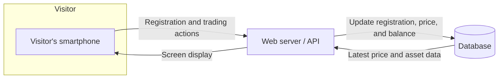
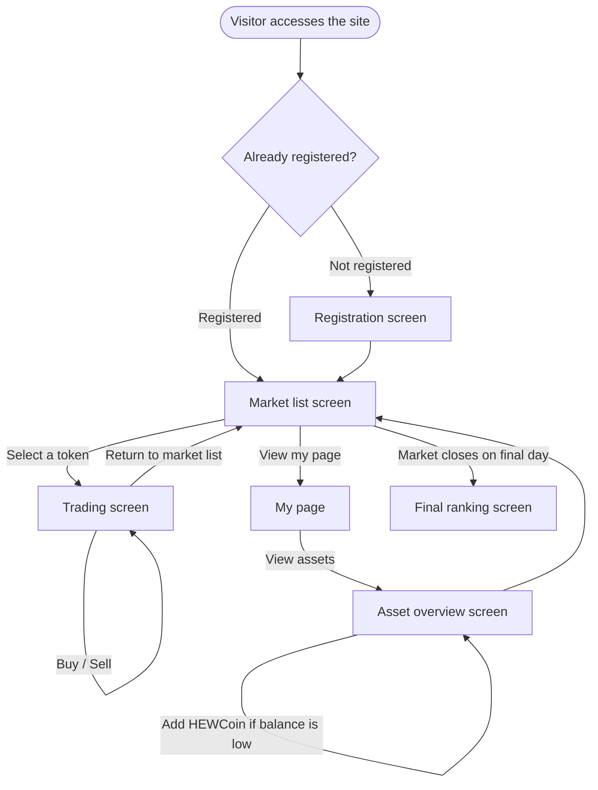
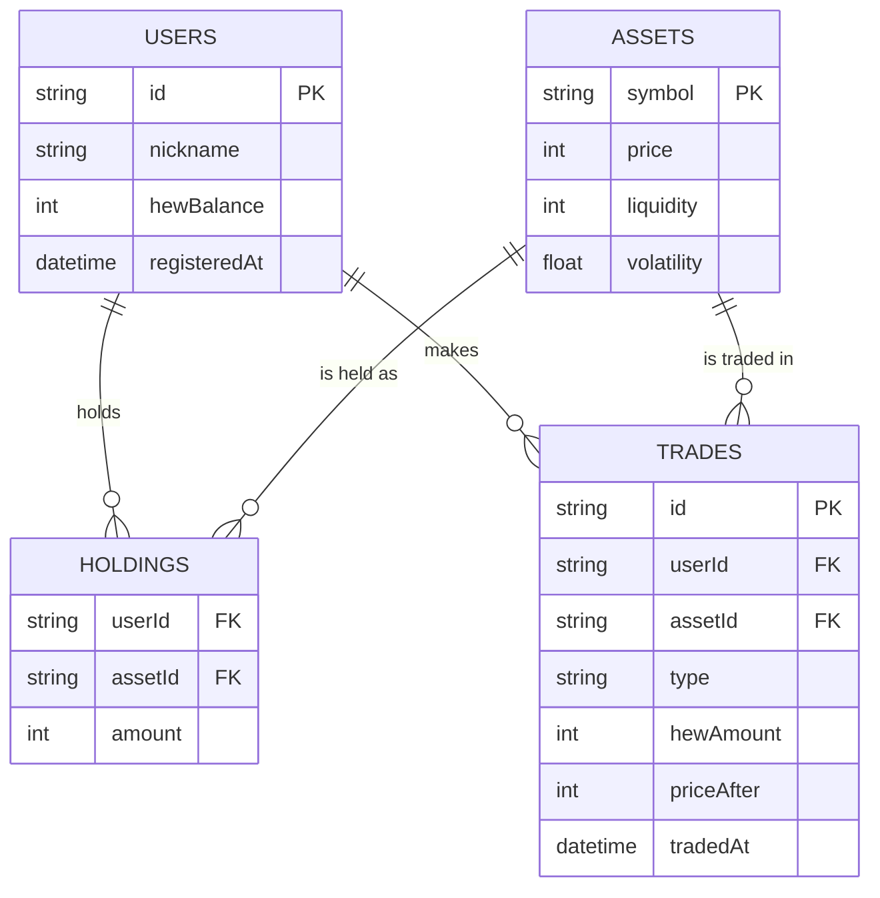
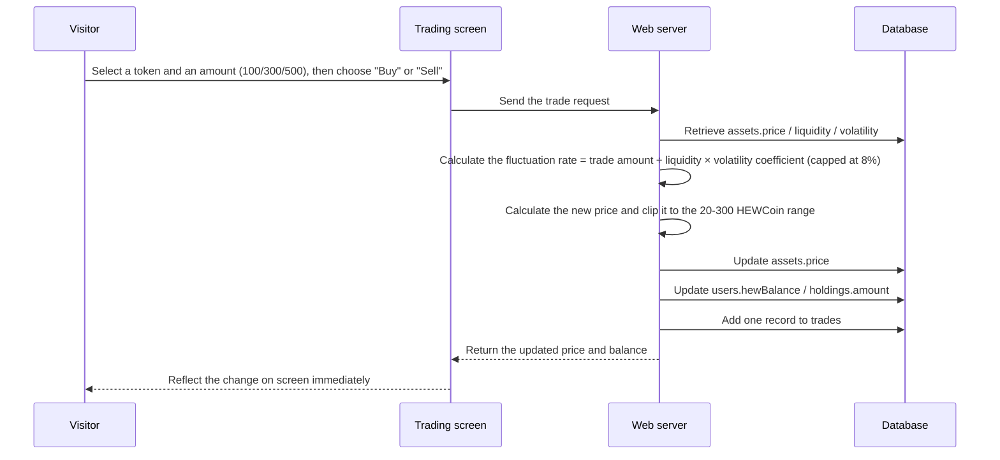

"HEW Crypto Market" Design Document (Basic Design)

- Class: IH12A233　　Group number: IH12A-04
- Related document: Requirements_Definition_HEWVer_EN.md

---

## 1. System Architecture

The system is implemented as a web application (no blockchain is used). Visitors access the server (database) from their own smartphones over the on-campus network.
* No large-screen display is used.



The system is published only within the on-campus network and is not made available to the public outside the school.

---

## 2. Screen Design

### 2.1 Screen List

| Screen | User | Role |
|---|---|---|
| Registration screen | Visitor | Register a nickname and begin using the service. This is the entry point that allows the same visitor's assets to carry over across multiple days of attendance. |
| Market list screen | Visitor | Display the current price and recent price movement of each token (GAME, CG, WEB) in a list. Entry point to the trading screen. |
| Trading screen | Visitor | Buy or sell the selected token in transaction amounts of 100, 300, or 500 HEWCoin. |
| My page | Visitor | View personal details such as the visitor's nickname and trade history. |
| Asset overview screen | Visitor | View HEWCoin balance, token holdings, total assets, and current ranking. Visitors can also request additional HEWCoin from this screen if their balance is too low. |
| Final ranking screen | Visitor / Operations staff | Display the finalized ranking after the market closes on the final day of the event. |

### 2.2 Screen Flow



### 2.3 Key Elements by Screen

**Registration screen**
- Nickname input field
- "Start" button (registers the visitor and grants 1,000 HEWCoin on first use only)

**Market list screen**
- Current price of each token (GAME, CG, WEB)
- Recent price movement (up or down)
- Token selection buttons (navigate to the trading screen)

**Trading screen**
- Name and current price of the selected token
- Buy/sell buttons for 100, 300, or 500 HEWCoin
- Immediate reflection of the updated price and balance after each action

**My page**
- Nickname display
- Trade history list (date/time, token, BUY/SELL, amount)
- Link to the asset overview screen

**Asset overview screen**
- HEWCoin balance
- Breakdown of token holdings (token name, quantity, value)
- Total assets
- Current ranking
- "Add HEWCoin" button (grants additional HEWCoin when the balance is low)

**Final ranking screen**
- Final ranking list based on each visitor's finalized total assets
- Highlighted display of the visitor's own final rank and final total assets

---

## 3. Database Design

### 3.1 ER Diagram



### 3.2 Table Definitions

**users (Visitors)**

| Column | Type | Description |
|---|---|---|
| id | string (PK) | Unique ID that identifies the visitor |
| nickname | string | Display nickname entered on the registration screen |
| hewBalance | int | HEWCoin balance (initial value: 1,000; also increases through the deposit action) |
| registeredAt | datetime | Registration timestamp (used to determine usage across multiple days) |

**assets (Tokens)**

| Column | Type | Description |
|---|---|---|
| symbol | string (PK) | Token type (GAME, CG, or WEB) |
| price | int | Current price (range: 20 to 300 HEWCoin) |
| liquidity | int | Liquidity (GAME: 5,000; CG: 8,000; WEB: 12,000) |
| volatility | float | Volatility coefficient (GAME: 1.4; CG: 1.0; WEB: 0.7) |

**holdings (Token Holdings)**

| Column | Type | Description |
|---|---|---|
| userId | string (FK) | Reference to the users table |
| assetId | string (FK) | Reference to the assets table |
| amount | int | Quantity held (used to calculate asset value) |

**trades (Trade History)**

| Column | Type | Description |
|---|---|---|
| id | string (PK) | Unique ID that identifies the transaction |
| userId | string (FK) | The visitor who made the transaction |
| assetId | string (FK) | The token involved in the transaction (null for a deposit) |
| type | string | Transaction type: BUY, SELL, or DEPOSIT |
| hewAmount | int | Transaction or deposit amount (for example, 100, 300, or 500 HEWCoin) |
| priceAfter | int | Price after the transaction (BUY/SELL only; used to display history on My page) |
| tradedAt | datetime | Date and time of the transaction |

---

## 4. Price-Fluctuation Logic and Processing Flow

### 4.1 Price-Fluctuation Formula

```
Fluctuation rate = Trade amount ÷ Liquidity × Volatility coefficient

When buying: Price = Current price × (1 + Fluctuation rate)
When selling: Price = Current price × (1 − Fluctuation rate)
```

- The fluctuation rate for a single transaction is capped at 8% (if the formula above produces a value greater than 8%, it is rounded down to 8%).
- The price is clipped to a range of 20 to 300 HEWCoin so it never falls below the lower bound or rises above the upper bound.

Because each token has its own liquidity and volatility coefficient, the size of the price movement differs even for the same trade amount. GAME has large price swings and generates excitement quickly, CG is stable, and WEB moves slowly and is designed to gain more value toward the end of the event.

### 4.2 Calculating Total Assets and Ranking

```
Total assets = HEWCoin balance + Σ (quantity of each token held × current token price)
```

All visitors' total assets are sorted in descending order. On the asset overview screen, this is shown as a real-time reference ranking. When the market closes on the final day of the event, it is shown as the finalized ranking.

### 4.3 Trading Process Flow



### 4.4 Registration and Session Handling

1. On first access, the visitor enters a nickname, and a new record is created in the users table with an initial HEWCoin balance of 1,000.
2. On later visits, the system identifies the same visitor using a user ID stored on the device, allowing assets and trade history to carry over across multiple days.
3. The specific identification method (cookies, local storage, etc.) is left as an open item; see Section 6, "Items for Further Consideration."

### 4.5 Final-Day Closing Process

1. At the end of the final day of the exhibition, an operator performs the "close" action. After this, no further trades or deposits are accepted.
2. Each visitor's total assets (HEWCoin balance plus the value of held tokens) are finalized, and the ranking is calculated.
3. The results are displayed on the final ranking screen.

The market runs continuously throughout the event period (2–3 days) and is not reset partway through (see Requirements Definition Document, Section 5-2).

---

## 5. Non-Functional Design

| Category | Design Approach |
|---|---|
| Access scope | The system is accessible only within the on-campus network; connections from outside the school are not accepted. |
| Performance | The system is designed for concurrent access; price updates are handled as lightweight, per-token operations. Visitor-facing response time is prioritized. |
| Availability | Each request is handled with its own exception handling so that one visitor's operation error does not affect other visitors. The system runs continuously throughout the event. |
| Environment constraints | Network traffic is kept to a minimum (mainly numeric data such as prices and balances) to account for on-campus Wi-Fi bandwidth. Images and other heavy assets are not used. |
| Security | Because the system does not handle personal information or payment information, no authentication feature is implemented; the system operates using anonymous nicknames only. |

---

## 6. Items for Further Consideration

- Selecting a session identification method (cookies, local storage, etc.) and how to persist login state across multiple days
- Testing concurrent access (load testing under on-campus Wi-Fi conditions)
- Access control for the final-day closing action (restricting it to operations staff only)
- How to prevent duplicate nicknames
