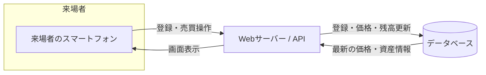
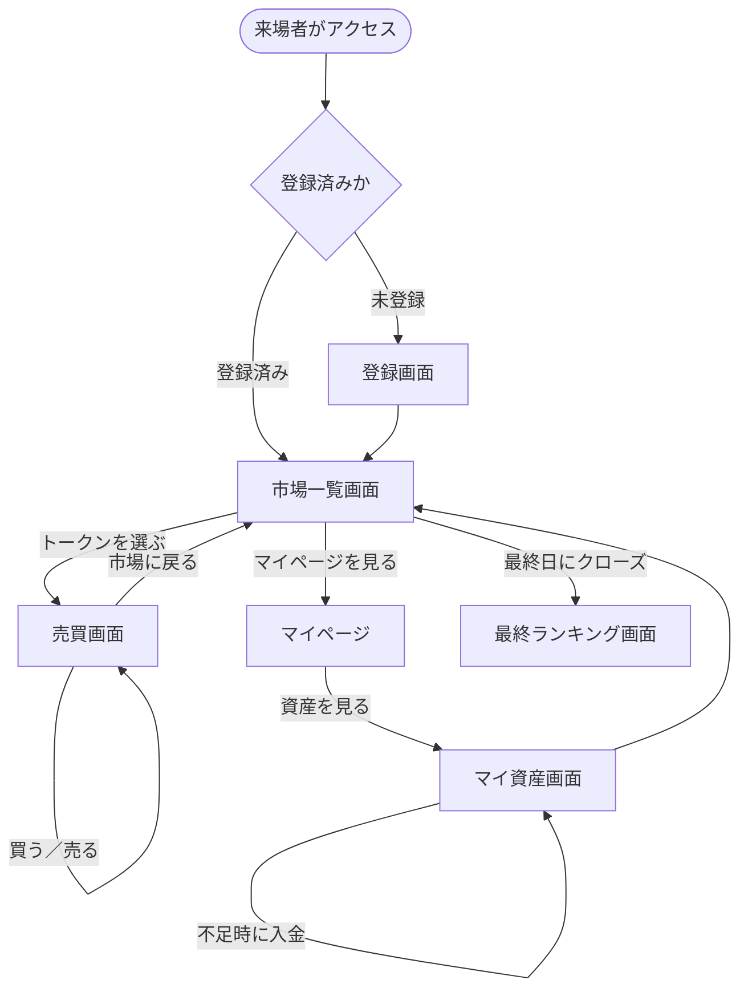
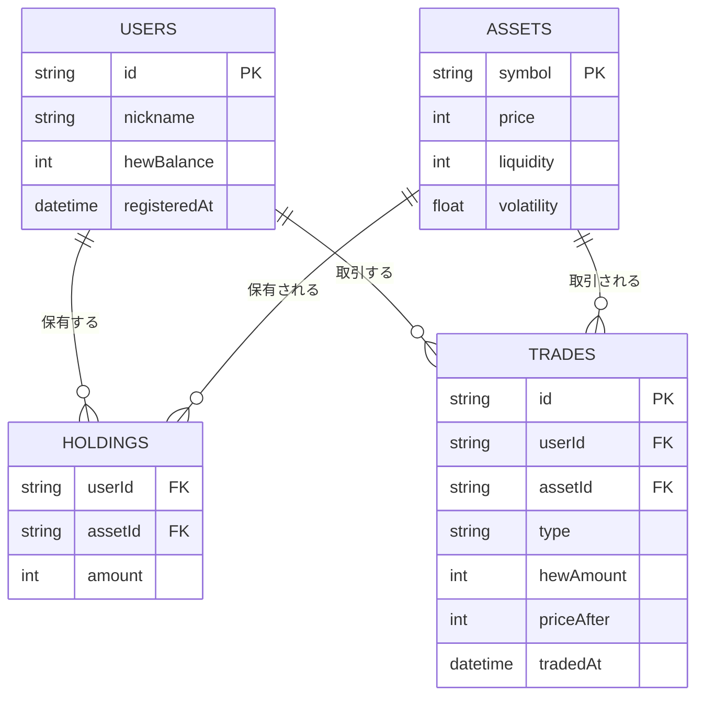
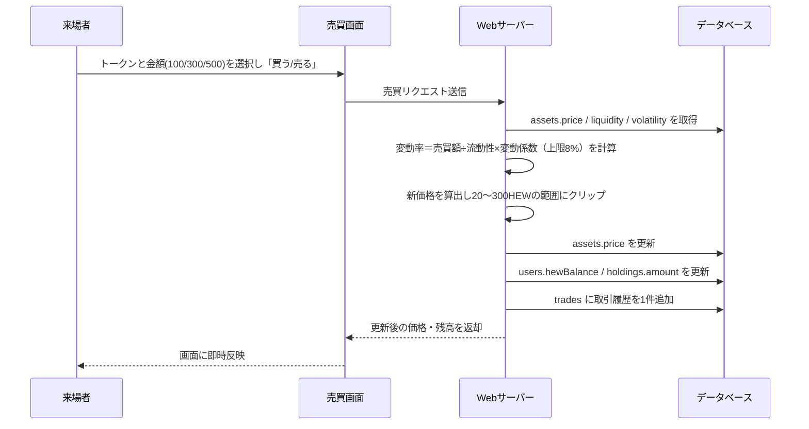

「HEW Crypto Market」設計書（基本設計）

- クラス：IH12A233　　グループ番号：IH12A-04
- 対応文書：要件定義書_HEWVer.md

---

## 1. システム構成

Webアプリとして実装する
（ブロックチェーンは使用しない）。来場者は各自のスマートフォンから、学内ネットワーク経由でサーバー（DB）にアクセスする構成とする。
* 大画面表示は行わない。



学内ネットワークに限定して公開し、学外への一般公開は行わない。

---

## 2. 画面設計

### 2.1 画面一覧

| 画面名 | 利用者 | 役割 |
|---|---|---|
| 登録画面 | 来場者 | ニックネームを登録し、利用を開始する。複数日にわたる来場でも同一ユーザーとして資産を引き継ぐための入口。 |
| 市場一覧画面 | 来場者 | GAME／CG／WEB各トークンの現在価格・値動きを一覧表示する。売買画面への入口。 |
| 売買画面 | 来場者 | 選択したトークンを100／300／500 HEW単位で売買する。 |
| マイページ | 来場者 | ニックネームや取引履歴など、本人の情報を確認する。 |
| マイ資産画面 | 来場者 | HEWCoin残高・保有トークン・総資産・現在の順位を確認する。HEWCoinが不足した場合の入金もここから行う。 |
| 最終ランキング画面 | 来場者／運営 | イベント最終日に市場をクローズした後、確定した最終ランキングを表示する。 |

### 2.2 画面遷移



### 2.3 画面ごとの主要要素

**登録画面**
- ニックネーム入力欄
- 「はじめる」ボタン（登録し、初回のみ1,000 HEWCoinを付与）

**市場一覧画面**
- 各トークン（GAME／CG／WEB）の現在価格
- 直近の値動き（上昇／下降）
- トークン選択ボタン（売買画面へ遷移）

**売買画面**
- 選択中のトークン名・現在価格
- 100／300／500 HEWの売買ボタン（買う／売る）
- 操作後の価格・残高の即時反映

**マイページ**
- ニックネーム表示
- 取引履歴一覧（日時・トークン・BUY/SELL・金額）
- マイ資産画面への導線

**マイ資産画面**
- HEWCoin残高
- 保有トークン内訳（トークン名・数量・評価額）
- 総資産額
- 現在の順位（ランキング）
- 「入金する」ボタン（HEWCoin不足時に追加付与）

**最終ランキング画面**
- 確定した総資産に基づく最終順位一覧
- 自分の最終順位・最終総資産のハイライト表示

---

## 3. データベース設計

### 3.1 ER図



### 3.2 テーブル定義

**users（来場者）**

| カラム名 | 型 | 説明 |
|---|---|---|
| id | string (PK) | 来場者を一意に識別するID |
| nickname | string | 登録画面で入力する表示用ニックネーム |
| hewBalance | int | HEWCoin残高（初期値1,000。入金操作でも増加する） |
| registeredAt | datetime | 登録日時（複数日にまたがる利用の判定に使用） |

**assets（トークン）**

| カラム名 | 型 | 説明 |
|---|---|---|
| symbol | string (PK) | トークン種別（GAME／CG／WEB） |
| price | int | 現在価格（20〜300 HEWの範囲） |
| liquidity | int | 流動性（GAME:5,000／CG:8,000／WEB:12,000） |
| volatility | float | 変動係数（GAME:1.4／CG:1.0／WEB:0.7） |

**holdings（保有トークン）**

| カラム名 | 型 | 説明 |
|---|---|---|
| userId | string (FK) | usersテーブルへの参照 |
| assetId | string (FK) | assetsテーブルへの参照 |
| amount | int | 保有量（評価額換算用） |

**trades（取引履歴）**

| カラム名 | 型 | 説明 |
|---|---|---|
| id | string (PK) | 取引を一意に識別するID |
| userId | string (FK) | 取引を行った来場者 |
| assetId | string (FK) | 取引対象のトークン（入金の場合はnull） |
| type | string | BUY／SELL／DEPOSIT（入金）の区分 |
| hewAmount | int | 取引・入金金額（100／300／500 HEWなど） |
| priceAfter | int | 取引後の価格（BUY／SELLのみ。マイページの履歴表示に使用） |
| tradedAt | datetime | 取引日時 |

---

## 4. 価格変動ロジック・処理フロー設計

### 4.1 価格変動の計算式

```
変動率 = 売買額 ÷ 流動性 × 変動係数

買う場合： 価格 = 現在価格 × (1 + 変動率)
売る場合： 価格 = 現在価格 × (1 − 変動率)
```

- 1回の取引による変動率は上限8%とする（上記式の結果が8%を超える場合は8%に丸める）。
- 価格は20 HEW〜300 HEWの範囲でクリップする（下限・上限を超えないようにする）。

トークンごとの流動性・変動係数により、同じ売買額でも値動きの大きさが変わる（GAMEは値動きが大きく短時間で盛り上がり、CGは安定、WEBはゆっくり後半に伸びる設計）。

### 4.2 総資産・ランキングの算出

```
総資産 = HEWCoin残高 ＋ Σ（保有トークン量 × トークンの現在価格）
```

全来場者の総資産を降順に並べ、マイ資産画面ではリアルタイムの参考順位として、イベント最終日のクローズ時には確定した最終ランキングとして表示する。

### 4.3 売買時の処理フロー



### 4.4 登録・セッション処理

1. 来場者は初回アクセス時にニックネームを入力し、usersテーブルに新規レコード（初期HEWCoin残高1,000）を作成する。
2. 以降のアクセスでは、端末に保存したユーザーIDをもとに同一ユーザーとして識別し、複数日にわたり資産・取引履歴を引き継ぐ。
3. 識別方法（Cookie／ローカルストレージ等）の具体的な選定は「6. 今後の検討事項」とする。

### 4.5 最終日クローズ処理

1. 展示最終日の終了時刻に、運営が「クローズ」操作を行う（以降、売買・入金を受け付けない）。
2. 各来場者の総資産（HEWCoin残高＋保有トークン評価額）を確定し、ランキングを算出する。
3. 最終ランキング画面に結果を表示する。

イベント期間（2〜3日間）を通して市場は継続し、途中でのリセットは行わない（要件定義書 5-2）。

---

## 5. 非機能設計

| 区分 | 設計方針 |
|---|---|
| 公開範囲 | 学内ネットワークに限定してアクセス可能とし、学外からの接続は受け付けない。 |
| 性能 | 同時アクセスを想定し、価格更新はトークン単位の軽量な更新処理とする。来場者操作のレスポンスを優先する。 |
| 可用性 | 1来場者の操作エラーが他の来場者に影響しないよう、リクエスト単位で例外処理を行う。開催期間中は継続稼働させる。 |
| 環境制約 | 学内Wi-Fiの帯域を考慮し、通信データを最小限（価格・残高などの数値中心）に抑える。画像や重いアセットは使用しない。 |
| 安全性 | 個人情報・決済情報を扱わないため、認証機能は設けず匿名ニックネームのみで運用する。 |

---

## 6. 今後の検討事項

- セッション識別方式（Cookie／ローカルストレージ等）の選定と、複数日にまたがるログイン状態の保持方法
- 同時アクセス数のテスト（学内Wi-Fi環境での負荷確認）
- 最終日クローズ操作の権限管理（運営のみ実行可能にする方法）
- ニックネームの重複防止方法
